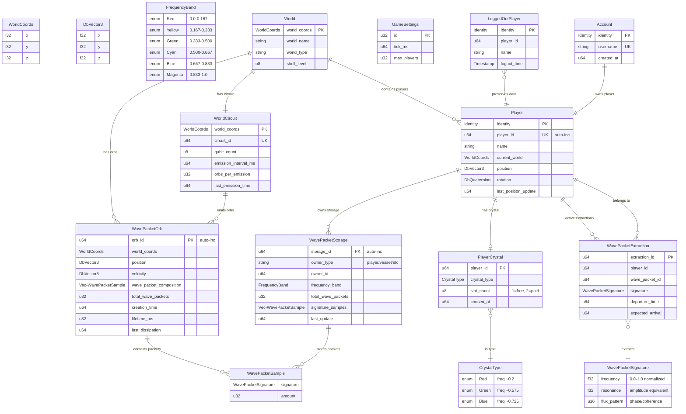

# SpacetimeDB Schema Diagram

## Table Descriptions

### Core Gameplay Tables

**World** - Defines each spherical world in the metaverse
- Center world: `(0,0,0)` with shell level 0
- Outer worlds: Shell 1+ at various coordinates
- Each world has unique properties and emission patterns

**Player** - Active players in the game
- Tracks position, rotation, and current world
- Identity links to Account for persistent data
- Position updates tracked with timestamps

**Account** - Persistent player accounts
- Username is unique across the game
- Identity persists across sessions
- Created timestamp for account age

### Wave Packet System

**WavePacketOrb** - Energy containers that spawn in worlds
- Contains multiple wave packet types (composition)
- Falls with velocity, dissipates over time
- Total packets decrease as mined or dissipated
- Visual color based on weighted packet composition

**WavePacketSignature** - Unique identifier for each packet type
- Frequency (0.0-1.0): Determines color and crystal matching
- Resonance: Amplitude/intensity of the packet
- Flux Pattern: Phase information for future mechanics

**WavePacketStorage** - Player inventory for wave packets
- Organized by frequency bands (6 colors)
- Tracks individual signature samples within each band
- Supports multiple owner types (players, vessels, etc.)

**PlayerCrystal** - Mining tool selection
- Players choose Red, Green, or Blue starter crystal
- Each crystal extracts packets within ±π/6 radians
- Slot count: 1 for free players, 2 for paid

**WavePacketExtraction** - Active mining notifications
- Server creates when packet extracted from orb
- Client uses for visual animation timing
- Tracks flight time based on distance

### World Systems

**WorldCircuit** - Quantum emitter at world center
- Periodically emits wave packet orbs
- Emission rate and quantity configurable
- Future: Players solve circuits for bonuses

### System Tables

**GameSettings** - Global configuration
**LoggedOutPlayer** - Preserves state across disconnections

## Mining System Flow

1. **Player** approaches **WavePacketOrb** within 30 units
2. **Player** toggles mining with equipped **PlayerCrystal**
3. Client calls `extract_wave_packet` every 2 seconds
4. Server validates and creates **WavePacketExtraction** entry
5. Client animates packet travel (distance/5 seconds)
6. On arrival, client calls `capture_wave_packet`
7. Server adds to **WavePacketStorage**

## Key Design Decisions

### Frequency System
- 6-color system based on normalized radians
- Each color covers ±π/6 range for crystal matching
- Shell-based rarity (Shell 0: RGB, Shell 1: RG/GB/BR)

### Client-Driven Extraction
- Client controls extraction timing (every 2 seconds)
- Server validates all operations
- Unique packet IDs prevent exploitation
- Visual feedback synchronized with server state

### Storage Organization
- Packets grouped by frequency band
- Individual signatures preserved for crafting
- Efficient querying by color type

### Future Expansions
- Multiple crystal slots for paid players
- Crafting system (2:1 color combinations)
- Trading between players
- Vessel-based automated mining
- Cross-world energy distribution