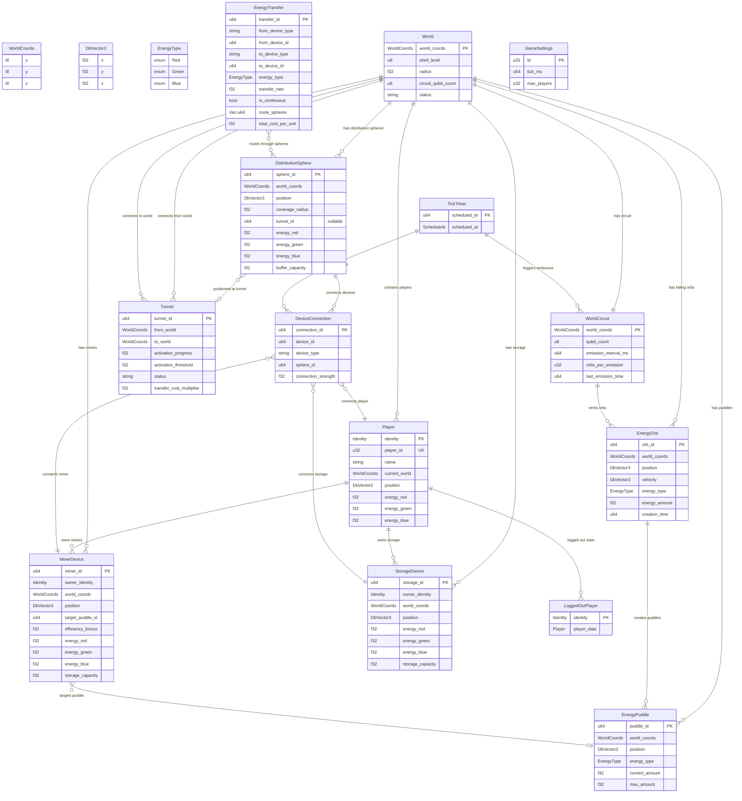

# SpacetimeDB Schema Diagram

## Table Descriptions

### Core Gameplay Tables

**World** - Defines each spherical world in the metaverse
- Center world: `(0,0,0)` with radius 100, shell level 0
- Future: Shell 1 worlds at `±1` coordinates with 2 qubits

**Player** - Active players in the game
- Spawns at random position on sphere surface
- Tracks energy inventory (red, green, blue)
- `current_world` determines which sphere they're on

**EnergyPuddle** - Static energy deposits on world surfaces
- Created when energy orbs hit the ground
- Players and miners can extract energy from these
- Each puddle has a specific energy type and amount

**EnergyOrb** - Dynamic energy falling from world circuits
- Falls from center of sphere outward to surface
- Creates puddles on impact
- Emitted every 5 seconds (6 orbs per emission)

### World Systems

**WorldCircuit** - Quantum gate at center of each world
- Periodically emits energy orbs
- 1 qubit for center world, more for outer shells
- Future: Players can solve quantum circuits for bonuses

### Energy Distribution Network

**DistributionSphere** - Floating energy routers at tunnel entrances
- Each tunnel has one distribution sphere
- Provides free local transfers within coverage radius
- Acts as buffer storage for cross-world transfers
- Handles routing between connected devices

**Tunnel** - Connections between worlds in the 3×3×3 grid
- Links outer worlds to center world initially
- Requires player activity near tunnel to activate
- Higher transfer costs for cross-tunnel energy movement
- Foundation for metaverse expansion

**DeviceConnection** - Links devices to distribution spheres
- Automatically connects devices within sphere coverage
- Determines which sphere handles device transfers
- Enables the "set transfer rule" abstraction layer

**EnergyTransfer** - Now routes through distribution network
- Local transfers: Device → Sphere → Device (free)
- Cross-world transfers: Device → Sphere → Tunnel → Sphere → Device (costly)
- Handles pathfinding through sphere network

### Player Infrastructure

**MinerDevice** - Automated energy collectors
- Players can build these near puddles
- Efficiency affected by quantum circuit solving
- Has storage capacity for collected energy

**StorageDevice** - Energy storage containers
- Large capacity for energy stockpiling
- Connected via energy distribution network
- Foundation for logistics and trading

**EnergyTransfer** - Active energy movements
- Handles automated transfers between devices
- Supports continuous flows (e.g., miner → storage)
- Foundation for distribution sphere network

### System Tables

**GameSettings** - Global game configuration
**TickTimer** - Scheduled events (10Hz tick rate)
**LoggedOutPlayer** - Preserves player state across disconnections

## Data Flow

1. **WorldCircuit** emits **EnergyOrb** every 5 seconds
2. **EnergyOrb** falls to surface and creates **EnergyPuddle**
3. **Player** or **MinerDevice** extracts energy from **EnergyPuddle**
4. **Devices** auto-connect to nearest **DistributionSphere** via **DeviceConnection**
5. **EnergyTransfer** routes through **DistributionSphere** network:
   - Local: Device → Sphere → Device (free)
   - Cross-world: Device → Sphere → **Tunnel** → Sphere → Device (costly)
6. **Player** builds logistics networks and activates new **Tunnels**
7. New **Worlds** become available as **Tunnels** activate